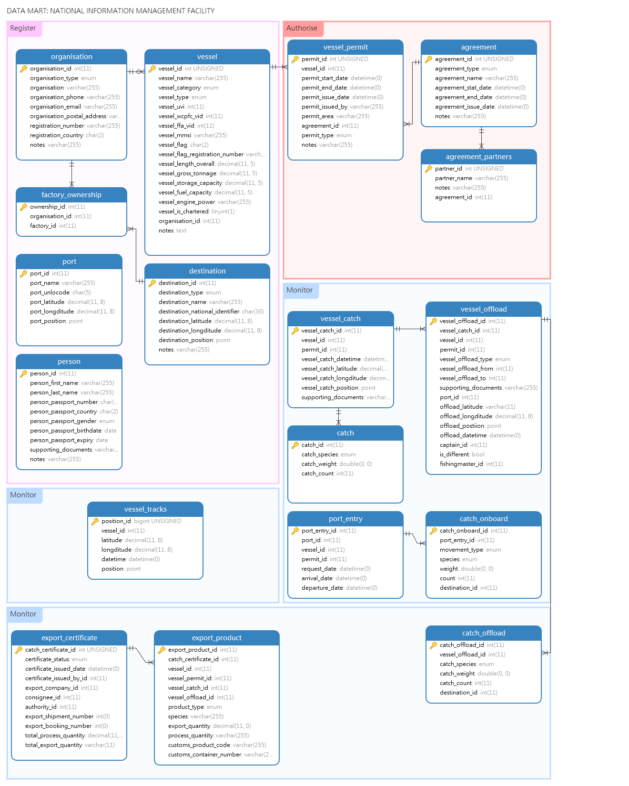

# Overview
The Fisheries NIMF (National Information Management Facility) is a datamart design used to 

- store offshore fisheries data... 
- that is pulled in from various operational systems 
- in a central location 
- in preparation for analysis

# Folder Structure

Here is what each folder contains

- **api**: the api folder contains the code for the REST API for the datamart application. This is one of the ways in which data is sent to the data mart.
- **app**: this folder contains the datamart web application which is written in PHP. This is where MCS Analysts can view what datasets are in the datamart.
- **docs**: this is where the web application for the documentation of the data mart is kept.
- **source**: this folder contains all the source and design files for the application.

# Design
The design of the datamart used to house operational fisheries data ready for MCS (Monitoring, Compliance and Surveillance) analysis

